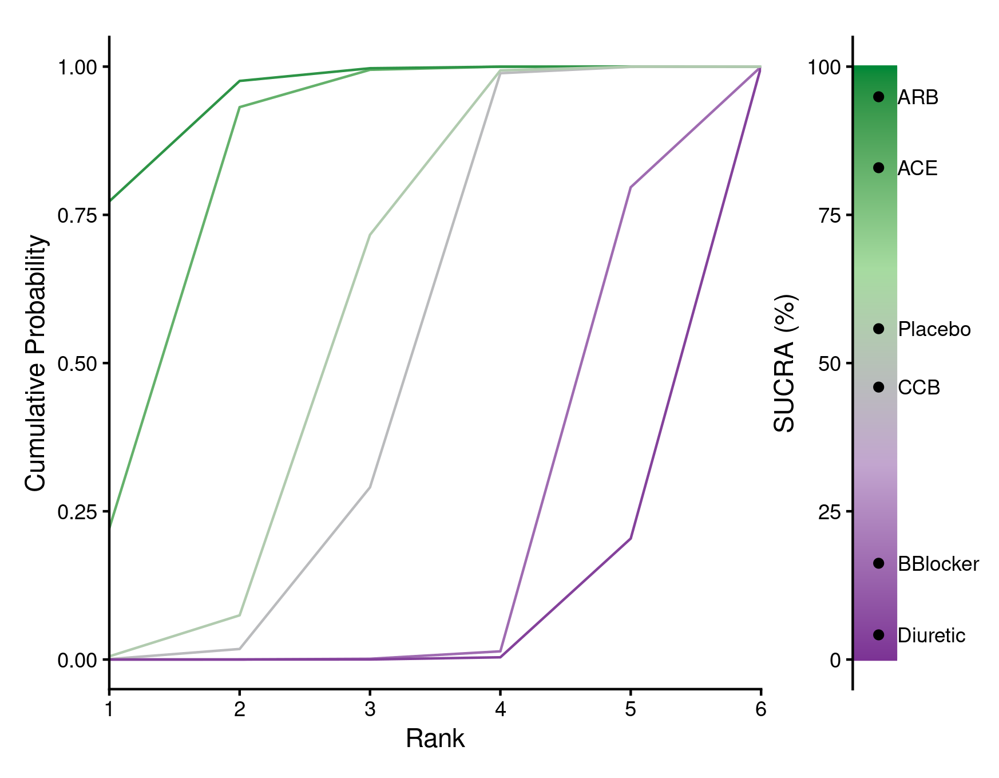
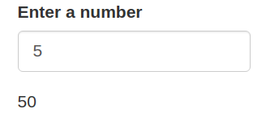
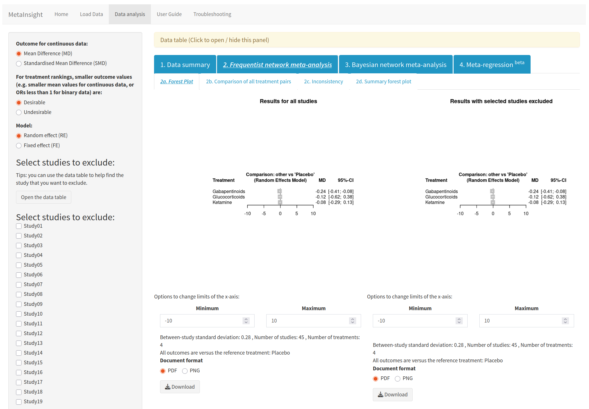
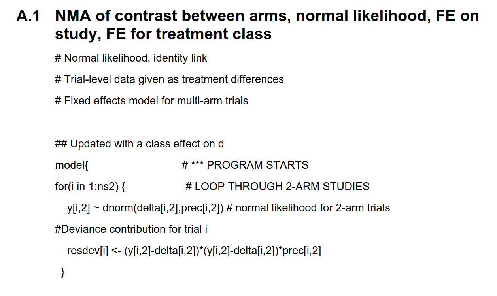
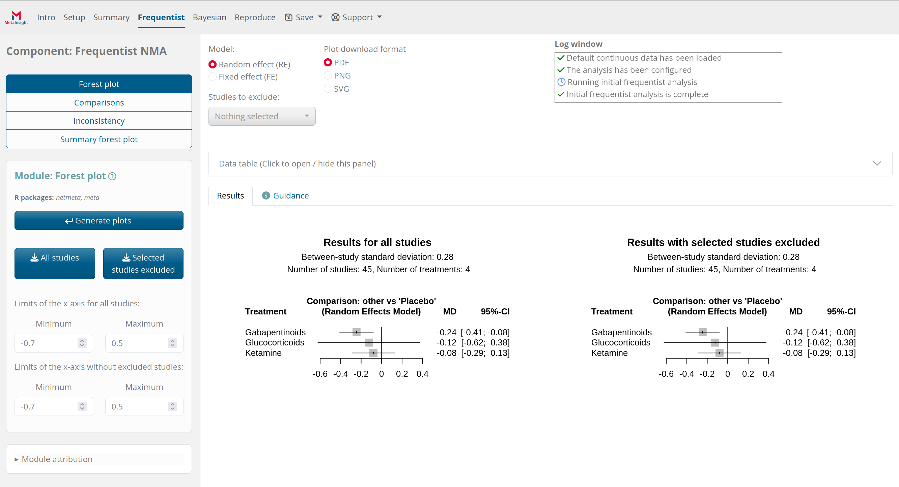
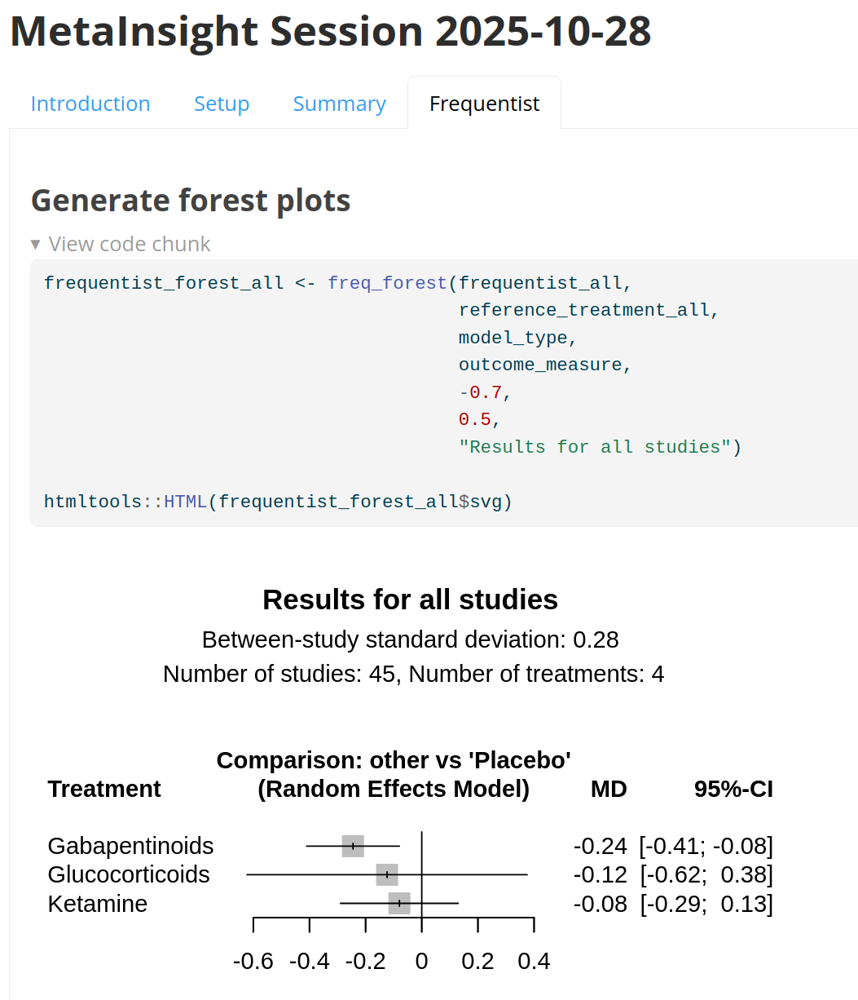
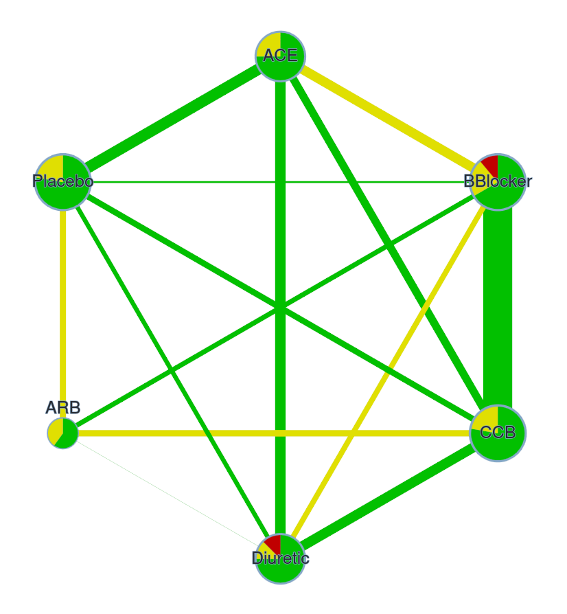
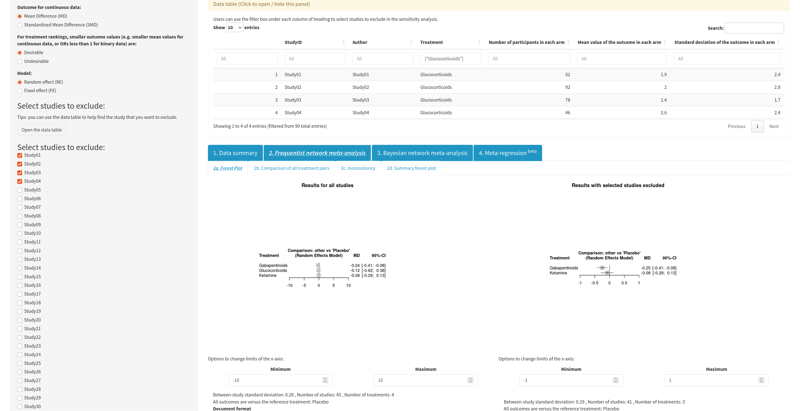

## Overview

```{css}
h1.title {
  background-image: url(images/mi_logo.png);
  background-repeat: no-repeat;
  background-position: center;
  background-size: 400px;
  padding: 60px 0;
  color: #00000000;
}
```

- What is NMA?
- History of MetaInsight
- Demonstration of new features
- How challenges were addressed

## Network meta-analysis can help determine the 'best' treatment option

::: columns
::: {.column width="50%"}

:::
::: {.column width="50%"}

:::
:::

::: footer
Data from Elliot & Meyer (2007) <a href="https://doi.org/10.1016/s0140-6736(07)60108-1" target="_blank">10.1016/s0140-6736(07)60108-1</a>
:::

## Complex meta-analyses require extensive statistical and programming knowledge

::: {.incremental .highlight-last}
- BUGSnet, bnma, coda, gemtc, meta, metafor, netmeta
- Bayesian models dependent on JAGS which may be hard to install
- Require data in different formats and use different terminology
:::

## Examples of different terminology
::: {.incremental .highlight-last}
- netmeta requires data in a 'wide' format while gemtc requires it in a 'long' format
- netmeta uses `random` and `common` while gemtc uses `random` and `fixed`
- bnma uses `common` and `independent` when gemtc uses `shared` and `unrelated`
:::


## Frequentist


## Bayesian


## Sensitivity analyses

- A key feature of MetaInsight is enabling sensitivity analyses by allowing studies to be excluded 


## Baseline risk meta-regression

- How does an approximation of the baseline health of participants in the studies affect conclusions?
- Determined by comparing the control arms of the studies


## Covariate meta-regression

- Do any covariates affect the response to a treatment?
- For example, does the age of participants affect the outcome?


## Shiny apps enable anybody to access the power of R {.mediumcode}

::: columns
::: {.column width="75%"}
<br/>
```{r eval = FALSE, echo = TRUE}
ui <- fluidPage(
  numericInput("number", "Enter a number", value = 5),
  textOutput("answer")
)

server <- function(input, output) {
  output$answer <- renderText(input$number * 10)
}

shinyApp(ui, server)
```
:::
::: {.column width="25%"}
<br/>

:::
:::


## Shiny removes barriers for accessing cutting-edge methods

::: columns
::: {.column width="60%"}
- MetaInsight was launched in 2019 to make NMA more accessible 
- Originally developed by statisticians, but increasingly in collaboration with developers 
:::
::: {.column width="40%"}

:::
:::

```{r echo = FALSE, eval = FALSE}
png("images/citations.png", 600, 600)
Year <- 2020:2026 
Citations <- c(6, 17, 28, 57, 66, 97, 29)
`Cumulative citations` <- cumsum(Citations)

par(cex = 1.5, bg = '#e4fbf8')
plot(Year, `Cumulative citations`, type = "l", col = "darkblue", lwd = 4, ylab = "", main = "Cumulative citations")
dev.off()
```


::: footer
Owen *et al.* (2019) <a href="https://doi.org/10.1002/jrsm.1373" target="_blank">10.1002/jrsm.1373</a>; Scopus (2026-03-27)
:::

::: notes
has users worldwide and increasing citations and use in CROs
:::


## A history of MetaInsight 

- 2017: Development begins as a 3 month PhD placement
- 2018: App launched featuring frequentist methods
- 2019: Bayesian analysis and 'long' data formats added
- 2020: Binary and continuous outcomes merged into a single app
- 2021: Code moved to GitHub
- 2023: Bayesian ranking panel added and code reorganised
- 2024: Meta-regression added

::: footer
Bradbury *et al.* (2025) <a href="https://doi.org/10.1186/s12874-024-02450-9" target="_blank">10.1186/s12874-024-02450-9</a>
:::


## MetaInsight has a global userbase

```{r}
library(ggplot2)
library(sf)
library(rnaturalearth)
library(rnaturalearthdata)
library(dplyr)

data <- read.csv("analytics.csv")
world <- ne_countries(scale = "medium", returnclass = "sf")

map_data <- world %>%
  left_join(data, by = c("name" = "country"))

ggplot(data = map_data) +
  geom_sf(aes(fill = count), color = "white", size = 0.2) +
  scale_fill_gradient(
    name = "Users",
    low = "#005c8a",
    high = "#e4042c",
    na.value = "grey90"
  ) +
  labs(
    title = "Users by country in 2025",
    caption = "Source: Google Analytics"
  ) +
  theme_void() +
  theme(
    legend.position = "right",
    plot.title = element_text(size = 16, face = "bold"),
    plot.subtitle = element_text(size = 12, color = "gray50"),
    panel.grid = element_blank()
  )
```


## 

<div style="display: flex; justify-content: center; margin-top: -80px">
  
</div>

::: notes

- some options always visible when not
- small graphs
- download everything as a png would take many clicks

:::

## The 'black box' nature of apps can limit uptake

::: columns
::: {.column width="50%"}
- Open science principles require that code can be rerun
- NICE require that NMAs are reproducible
:::

::: {.column width="50%"}

:::
:::

::: footer
<a href="https://www.nice.org.uk/guidance/ng238" target="_blank">nice.org.uk/guidance/ng238</a> 
:::


## shinyscholar was developed to address this

::: columns
::: {.column width="70%"}
:::{.incremental .highlight-last}
- {shinyscholar} was forked from {wallace} to make development of reproducible apps easier
- Convert core functionality into functions and package
- App becomes an interface to the functions, dealing with interactivity
:::
:::
::: {.column width="30%"}

:::
:::

##

<div style="display: flex; justify-content: center;">
  
</div>

::: footer
<a href="https://crsu.shinyapps.io/MetaInsight_Scholar/" target="_blank">crsu.shinyapps.io/MetaInsight_Scholar</a> 
:::


## Aims
:::{.incremental .highlight-last}
- Make analyses conducted in MetaInsight reproducible
- Produce a downloadable report
- Improve quality and consistency of downloaded plots
- Add more automated tests
- Maintain user experience
:::

## Different architecture to shinyscholar

- Parallel analyses rather than linear
- Needed to maintain the functionality of excluding studies at any point

## Functions do things, modules control when to call functions

- Critical to the architecture is splitting up the analysis (what) from the app (when)


## 

* Setup - che


## Reproducibility relies on a strict structure
::: {.incremental .highlight-last}
- Each module has an id made up of the component and module `summary_network`
- Each calls a synonymous function `summary_network()`
- Input values are stored in `common$meta$summary_network$<input id>`
- Values are knitted into an .Rmd chunk and combined to create a .qmd
:::

## Reproducibility relies on a strict structure {.mediumcode}

::: {.fragment .fade-in}
````markdown
```{{asis, echo = {{summary_network_knit}}, eval = {{summary_network_knit}}, include = {{summary_network_knit}}}}
### Display the networks for the original data and data with excluded studies.
{r,  results = 'asis'}
```
```{{r, echo = {{summary_network_knit}}, include = {{summary_network_knit}}}}
summary_network(configured_data,
                {{summary_network_style}}, 
                {{summary_network_label_all}}, 
                "Network plot of all studies")
```
````
:::

<br/>

::: {.fragment .fade-in}

````markdown
### Display the networks for the original data and data with excluded studies.

```{{r, results = 'asis'}}
summary_network(configured_data, 
                "netplot", 
                1, 
                "Network plot of all studies")
```
````
:::

## Reproducibility also enables improved reporting
::: columns
::: {.column width="50%"}
- Use as the basis for writing a publication
- Rendered in the app to produce an html report
:::
::: {.column style="margin-top: -80px;"}

:::
:::

## Incorporating risk of bias scores improves sensitivity analyses
::: {.incremental .highlight-last}
- MetaInsight enables sensitivity analyses by excluding studies
- During reviews, risk of bias information can be collected e.g.
  - Randomisation, blinding, missing data
- Scores can guide sensitivity analyses
:::

## Integration with CINeMA helps to evaluate confidence in findings

::: columns
::: {.column width="50%"}


- Uses risk of bias scores for *studies* to evaluate evidence for *treatments*

:::
::: {.column width="50%"}

:::
:::

::: footer
<a href="https://cinema.ispm.unibe.ch/" target="_blank">cinema.ispm.unibe.ch</a> ;
Papakonstantinou *et al.* (2020) <a href="https://doi.org/10.1002/cl2.1080" target="_blank">10.1002/cl2.1080</a> 
:::

## Benefits of CRAN

- Simple to install and run locally
- Can use various tools for checking code 
- We will learn in advance if developers of the analytical packages make breaking changes 

## Uploaded datasets can create difficulties

- Contain errors which could crash the app
- Vary in the number of studies and treatments

## Excluding studies

- Previously studies were listed in the sidebar
- Information was provided in a table




## Slow-running tasks run in the background

- Fitting models can block the app for other users
- Can cancel


## Producing publication-ready figures

- Ideally plots can be downloaded and used without further editing
- We reuse plots from other packages

https://simon-smart88.github.io/forest_plot_blog/forest_blog.html 


## Tests

- As complexity increases, updating code can have unintended consequences
- Automated tests can give us confidence that everything is working
- Already a lot of testing in place
- Now the app is also run and all the buttons pressed on GitHub


## Data names

- `main` or no suffix
- `_sub`, `_exclude` and `_sensitivity`

## Limitations of button pressing

- In the current version, the analyses run automatically once data is loaded
- For reproducibility, we need explicit decisions on what is run
- Modules all have a button to press, either with the mouse or Enter
- Once pressed, they update automatically
- Within the sections, a run all option runs all of them
- If they can't yet be run, an error message takes you to the relevant module
- 

## Reactivity is a blessing and a curse

- Reactivity controls when code is rerun
- As complexity grows, it can be difficult to control and code can rerun unnecessarily


## Running locally

```{r eval = FALSE}
library(metainsight)
run_metainsight()

run_metainsight(load_file = "saved_file.rds")
```


## Analyses can also be conducted without the app

- A side product of enabling reproducibility is that the analysis functions work outside of the app
- Some users may be comfortable with coding, but the NMA packages are not straightforward to use

```{r eval = FALSE, echo = TRUE}
configured_data <- setup_load("my_data.csv", outcome = "continuous") |>
  setup_configure(reference_treatment = "Placebo",
                  effects = "random",
                  outcome_measure = "MD",
                  ranking_option = "good",
                  seed = 123)
```

## Analyses can also be conducted without the app

```{r eval = FALSE, echo = TRUE}
freq_forest(configured_data) |> 
  write_plot("frequentist_forest_plot.pdf")

bayes_model(configured_data) |> 
  bayes_forest() |>
  write_plot("bayesian_forest_plot.pdf")
```


## Saving and loading

- Analyses can also be saved to a file and restored later on


## User feedback


## Future plans

- Incorporate guidance 
- Bulk downloads
- More options for customisation - models and plots
- More options for exclusions


## Acknowledgments {.mediumtext}

::: columns
::: {.column width="70%"}
- Naomi Bradbury, Ryan Field, Tom Morris, Clareece Nevill, Janion Nevill, Alex Sutton, Nicola Cooper, Suzanne Freeman
- Wellcome (via Chan Zuckerburg Initiative)
- NIHR
- <a href="mailto:ss1545@le.ac.uk">Email</a>, <a href="https://github.com/simon-smart88" target="_blank">Github</a>, <a href="https://bsky.app/profile/simonsmart.bsky.social" target="_blank">Bluesky</a>
- <a href="https://www.gla.ac.uk/research/az/crsu/apps/" target="_blank">More apps</a>
:::
::: {.column width="30%"}
<div> 


</div>
:::
:::

